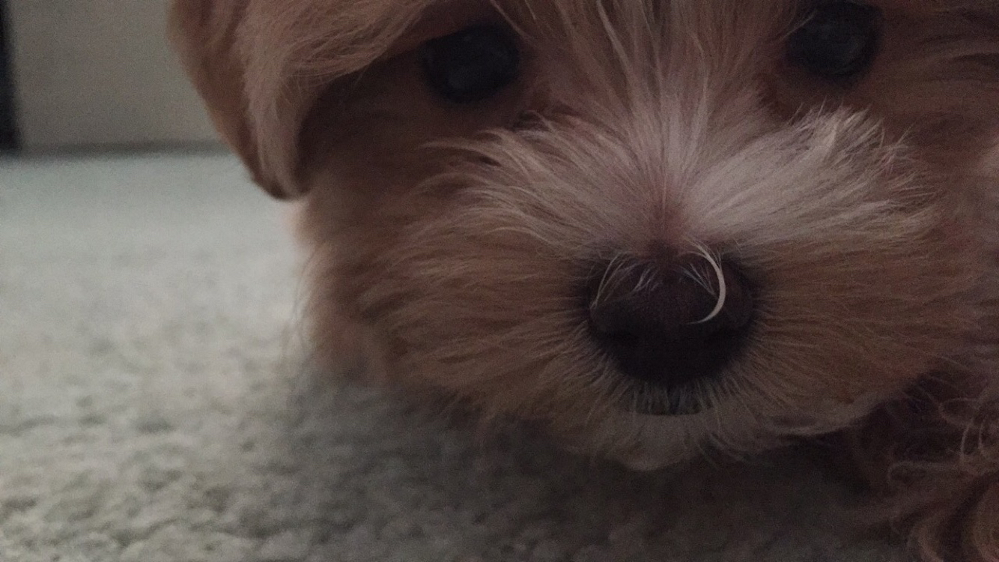

<html>

   

	<a href="https://erikasudderth.github.io/">
		<button style = "width = 20%">  About Me  </button>
	</a>

	<a href="SchoolWebsiteResumePDF.pdf">
		<button style = "width = 20%">  Resume  </button>
	</a> 
   	
	<a href="Projects.html">
		<button style = "width = 20%">  Projects  </button>
	</a>

	<a href="ContactInformation.html">
		<button style = "width = 20%">  Contact Information  </button>
	</a>

  

<body>
	    	
	

    	
    	

    	<h1>  About Me  </h1>

    	
 
		 
			My name is Erika Sudderth and I am currently a second degree student studying Computer Science at the University of North Carolina at Greensboro. I am interested in internships directly involving programming to improve my problem-solving skills and my knowledge of the computer science field. 
			 
			In my free time, I enjoy reading, kayaking, playing with my dog, and spending time with family and friends.

 
	

	
  
   
    
  </body>
  
</html>

  
